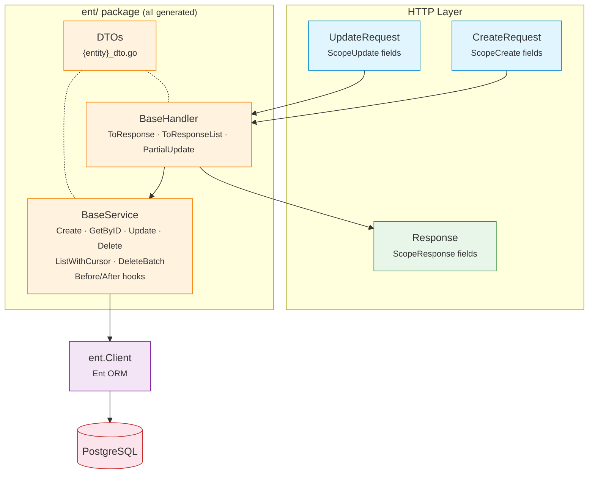

# EntDomain

[](https://pkg.go.dev/github.com/githonllc/entdomain)
[](https://goreportcard.com/report/github.com/githonllc/entdomain)
[](https://opensource.org/licenses/MIT)

An [Ent](https://entgo.io) extension that generates HTTP request/response DTOs, base service structs, and base handler structs from annotated schemas.

## Features

- **Annotation-driven** — mark field scopes with concise builders (`DefaultField`, `InputOnlyField`, `OutputOnlyField`, etc.)
- **HTTP DTOs** — generates `CreateRequest`, `UpdateRequest`, `Response`, `ListResponse` per entity
- **BaseService** — CRUD operations with Before/After hooks, builder helpers, and entity→response conversion
- **BaseHandler** — response conversion helpers and partial update support
- **Soft-delete detection** — automatically generates `UpdateOneID().SetDeletedAt(now)` for entities with a `deleted_at` field
- **Cursor pagination** — ID-based keyset pagination in BaseService
- **Source provenance** — generated files include schema name, template path, and regeneration command

## Requirements

- Go 1.23+
- [Ent](https://entgo.io) v0.14+

## Installation

```bash
go get github.com/githonllc/entdomain
```

## Setup

Wire the extension in your `entc.go`:

```go
//go:build ignore

package main

import (
    "log"

    "entgo.io/ent/entc"
    "entgo.io/ent/entc/gen"
    "github.com/githonllc/entdomain"
)

func main() {
    ext := entdomain.NewExtensionWithOptions(
        entdomain.WithEntDomainPackage("github.com/githonllc/entdomain"),
        entdomain.WithBaseService(true),
        entdomain.WithBaseHandler(true),
    )

    if err := entc.Generate("./schema", &gen.Config{
        Target:  "../ent",
        Package: "your/module/ent",
    }, entc.Extensions(ext)); err != nil {
        log.Fatal(err)
    }
}
```

Then run:

```bash
go generate ./...
```

## Annotation Builders

### Base Builders

```go
entdomain.DefaultField()                      // all scopes: create, update, response
entdomain.InputOnlyField()                    // create + update only (e.g., password)
entdomain.OutputOnlyField()                   // response only (e.g., timestamps, state)
entdomain.CreateOnlyField()                   // create + response (immutable after creation)
entdomain.NewDomainField()                    // no scopes (tracked by ent but not in any HTTP struct)
entdomain.DomainFieldWithScopes(scopes...)    // custom scope combination
```

### Fluent Builder API

```go
field.String("email").
    Annotations(
        entdomain.DefaultField().
            WithRequired(entdomain.ScopeCreate),
    )
```

## Schema Example

```go
package schema

import (
    "time"

    "entgo.io/ent"
    "entgo.io/ent/schema/field"
    "github.com/githonllc/entdomain"
)

type User struct {
    ent.Schema
}

func (User) Fields() []ent.Field {
    return []ent.Field{
        field.String("name").
            NotEmpty().
            Annotations(
                entdomain.DefaultField().
                    WithRequired(entdomain.ScopeCreate),
            ),

        field.String("email").
            Optional().
            Annotations(entdomain.DefaultField()),

        field.Time("created_at").
            Default(time.Now).
            Immutable().
            Annotations(entdomain.OutputOnlyField()),
    }
}
```

## Architecture



**Key principle**: Scopes only control HTTP-layer struct generation. The service layer operates directly on ent entities with full ORM capabilities.

## Generated Code

For each annotated schema, up to three files are generated (all in the `ent/` package):

| File | Contains |
|------|----------|
| `{entity}_dto.go` | `CreateRequest`, `UpdateRequest`, `Response`, `ListResponse`, `Validate()` methods |
| `{entity}_base_service.go` | `BaseService` with CRUD, Before/After hooks, `Apply*Request` builders, `EntToResponse` |
| `{entity}_base_handler.go` | `BaseHandler` with `ToResponse`, `ToResponseList`, `PartialUpdate` |

### BaseService Pattern

Generated `Base{Entity}Service` provides CRUD operations with hook extension points. Embed it and override hooks for custom logic:

```go
type myUserService struct {
    ent.BaseUserService
}

func NewMyUserService(db *ent.Client) *myUserService {
    s := &myUserService{
        BaseUserService: ent.BaseUserService{DB: db},
    }
    s.SetSelf(s) // enable hook dispatch to this struct
    return s
}

func (s *myUserService) BeforeCreate(ctx context.Context, req *ent.UserCreateRequest) error {
    // custom validation
    return nil
}

func (s *myUserService) AfterCreate(ctx context.Context, entity *ent.User) (*ent.User, error) {
    // publish event, etc.
    return entity, nil
}
```

## Typed Errors

BaseService wraps Ent errors with standard sentinel values:

```go
var (
    entdomain.ErrNotFound      // entity not found
    entdomain.ErrAlreadyExists // uniqueness constraint violation
    entdomain.ErrValidation    // validation failed
)
```

## Field Scopes

Scopes control which HTTP-layer DTOs include a field. They do **not** restrict service layer access.

| Scope | Description |
|-------|-------------|
| `ScopeCreate` | Field appears in `CreateRequest` |
| `ScopeUpdate` | Field appears in `UpdateRequest` |
| `ScopeResponse` | Field appears in `Response` |

## Extension Options

```go
entdomain.WithBaseService(true)              // generate BaseService (default: false)
entdomain.WithBaseHandler(true)              // generate BaseHandler (default: false)
entdomain.WithEntDomainPackage("custom/path") // override entdomain import path
```

## Contributing

See [CONTRIBUTING.md](CONTRIBUTING.md) for development setup and guidelines.

## License

[MIT](LICENSE)
