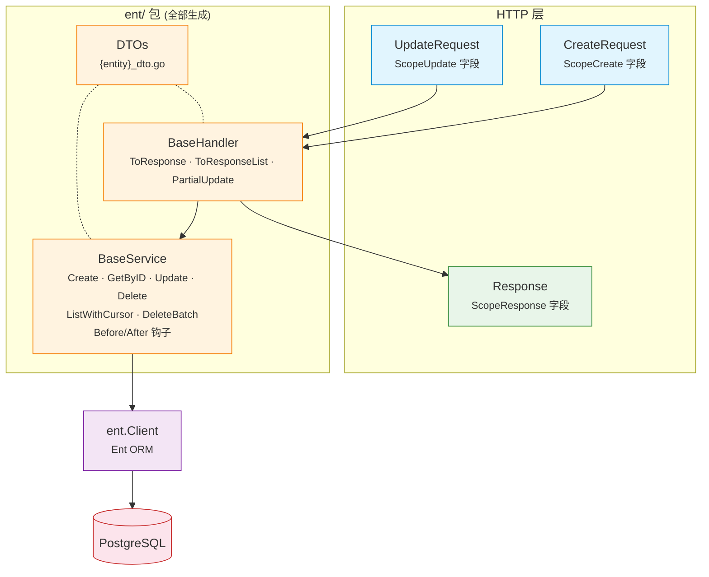

# EntDomain

[](https://pkg.go.dev/github.com/githonllc/entdomain)
[](https://goreportcard.com/report/github.com/githonllc/entdomain)
[](https://opensource.org/licenses/MIT)

一个 [Ent](https://entgo.io) 扩展，从带注解的 schema 自动生成 HTTP 请求/响应 DTO、基础服务和基础处理器。

## 特性

- **注解驱动** — 使用简洁的构建器标记字段作用域（`DefaultField`、`InputOnlyField`、`OutputOnlyField` 等）
- **HTTP DTO** — 为每个实体生成 `CreateRequest`、`UpdateRequest`、`Response`、`ListResponse`
- **BaseService** — 带 Before/After 钩子的 CRUD 操作、构建器辅助和实体→响应转换
- **BaseHandler** — 响应转换辅助和部分更新支持
- **软删除检测** — 自动为包含 `deleted_at` 字段的实体生成 `UpdateOneID().SetDeletedAt(now)`
- **游标分页** — BaseService 中基于 ID 的键集分页
- **来源追溯** — 生成的文件包含 schema 名称、模板路径和重新生成命令

## 环境要求

- Go 1.23+
- [Ent](https://entgo.io) v0.14+

## 安装

```bash
go get github.com/githonllc/entdomain
```

## 配置

在 `entc.go` 中注册扩展：

```go
//go:build ignore

package main

import (
    "log"

    "entgo.io/ent/entc"
    "entgo.io/ent/entc/gen"
    "github.com/githonllc/entdomain"
)

func main() {
    ext := entdomain.NewExtensionWithOptions(
        entdomain.WithEntDomainPackage("github.com/githonllc/entdomain"),
        entdomain.WithBaseService(true),
        entdomain.WithBaseHandler(true),
    )

    if err := entc.Generate("./schema", &gen.Config{
        Target:  "../ent",
        Package: "your/module/ent",
    }, entc.Extensions(ext)); err != nil {
        log.Fatal(err)
    }
}
```

然后运行：

```bash
go generate ./...
```

## 注解构建器

### 基础构建器

```go
entdomain.DefaultField()                      // 所有作用域：创建、更新、响应
entdomain.InputOnlyField()                    // 仅创建和更新（如密码）
entdomain.OutputOnlyField()                   // 仅响应（如时间戳、状态）
entdomain.CreateOnlyField()                   // 创建 + 响应（创建后不可变）
entdomain.NewDomainField()                    // 无作用域（ent 追踪但不在任何 HTTP 结构体中）
entdomain.DomainFieldWithScopes(scopes...)    // 自定义作用域组合
```

### 流式构建器 API

```go
field.String("email").
    Annotations(
        entdomain.DefaultField().
            WithRequired(entdomain.ScopeCreate),
    )
```

## Schema 示例

```go
package schema

import (
    "time"

    "entgo.io/ent"
    "entgo.io/ent/schema/field"
    "github.com/githonllc/entdomain"
)

type User struct {
    ent.Schema
}

func (User) Fields() []ent.Field {
    return []ent.Field{
        field.String("name").
            NotEmpty().
            Annotations(
                entdomain.DefaultField().
                    WithRequired(entdomain.ScopeCreate),
            ),

        field.String("email").
            Optional().
            Annotations(entdomain.DefaultField()),

        field.Time("created_at").
            Default(time.Now).
            Immutable().
            Annotations(entdomain.OutputOnlyField()),
    }
}
```

## 架构



**核心原则**：作用域仅控制 HTTP 层结构体生成。服务层直接操作 ent 实体，拥有完整的 ORM 能力。

## 生成的代码

为每个带注解的 schema 最多生成三个文件（均在 `ent/` 包中）：

| 文件 | 内容 |
|------|------|
| `{entity}_dto.go` | `CreateRequest`、`UpdateRequest`、`Response`、`ListResponse`、`Validate()` 方法 |
| `{entity}_base_service.go` | 带 CRUD、Before/After 钩子、`Apply*Request` 构建器、`EntToResponse` 的 `BaseService` |
| `{entity}_base_handler.go` | 带 `ToResponse`、`ToResponseList`、`PartialUpdate` 的 `BaseHandler` |

### BaseService 模式

生成的 `Base{Entity}Service` 提供带钩子扩展点的 CRUD 操作。嵌入它，覆盖钩子即可添加自定义逻辑：

```go
type myUserService struct {
    ent.BaseUserService
}

func NewMyUserService(db *ent.Client) *myUserService {
    s := &myUserService{
        BaseUserService: ent.BaseUserService{DB: db},
    }
    s.SetSelf(s) // 启用钩子分发到此结构体
    return s
}

func (s *myUserService) BeforeCreate(ctx context.Context, req *ent.UserCreateRequest) error {
    // 自定义验证
    return nil
}

func (s *myUserService) AfterCreate(ctx context.Context, entity *ent.User) (*ent.User, error) {
    // 发布事件等
    return entity, nil
}
```

## 类型化错误

BaseService 将 Ent 错误包装为标准哨兵值：

```go
var (
    entdomain.ErrNotFound      // 实体未找到
    entdomain.ErrAlreadyExists // 唯一约束冲突
    entdomain.ErrValidation    // 验证失败
)
```

## 字段作用域

作用域控制 HTTP 层 DTO 中包含哪些字段。它们**不会**限制服务层的访问。

| 作用域 | 说明 |
|--------|------|
| `ScopeCreate` | 字段出现在 `CreateRequest` 中 |
| `ScopeUpdate` | 字段出现在 `UpdateRequest` 中 |
| `ScopeResponse` | 字段出现在 `Response` 中 |

## 扩展选项

```go
entdomain.WithBaseService(true)              // 生成 BaseService（默认：false）
entdomain.WithBaseHandler(true)              // 生成 BaseHandler（默认：false）
entdomain.WithEntDomainPackage("custom/path") // 覆盖 entdomain 导入路径
```

## 贡献

请参阅 [CONTRIBUTING.md](CONTRIBUTING.md) 了解开发配置和指南。

## 许可证

[MIT](LICENSE)
